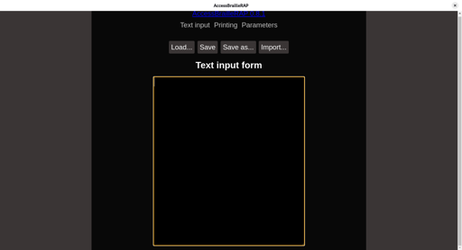

# Detailed Installation Guide for AccessBrailleRAP

This guide provides comprehensive instructions for installing AccessBrailleRAP by building from source or using Docker. These methods are suitable for users who require more control over their installation, are developing the software, or are using specific system configurations not covered by the pre-built binaries.

If you are looking for the quickest way to get started, please refer to the "Installation" section in the [Getting Started with BrailleRAP](GETTING_STARTED_BRAILLERAP.md) guide, which focuses on using pre-built binaries.

## 1. Building from Source

Building AccessBrailleRAP from its source code requires a basic understanding of command-line operations and development environments. Choose the section relevant to your operating system.

### 1.1. For Windows

**Prerequisites:**

* **Python 3.6 or later:** Ensure it's added to your system's PATH during installation.
* **Node.js 20.12 or later:** Install from the official Node.js website.
* **Git:** Install Git to clone the repository.

**Step-by-Step Instructions:**

1. **Open a Command Prompt or PowerShell.**

2. **Clone the AccessBrailleRAP Repository:**
   
   ```bash
   git clone https://github.com/braillerap/AccessBrailleRAP.git
   ```

3. **Navigate into the Project Directory:**
   
   ```bash
   cd AccessBrailleRAP
   ```

4. **Create a Python Virtual Environment:** This isolates project dependencies.
   
   ```bash
   python -m venv venv
   ```

5. **Activate the Python Virtual Environment:**
   
   ```bash
   .\venv\Scripts\activate
   ```

6. **Install Python Dependencies:**
   
   ```bash
   pip install -r requirements.txt
   ```

7. **Install Node.js Dependencies:**
   
   ```bash
   npm install
   ```

8. **Build the Windows Executable:** This will create a standalone `.exe` file.
   
   ```bash
   npm run buildview
   ```
   
   The compiled executable (`.exe`) will be found in the `dist` folder within your project directory.

*(Screenshot: Example of the `dist` folder content with the executable highlighted)*

### 1.2. For Linux Debian 13

**Prerequisites:**

* **Python 3 and Python 3 `venv` module.**
* **Node.js 20.x and npm.**
* **GCC and general build tools:** `git-extras`, `lintian`.
* **Additional Python development headers and GTK/WebKit dependencies:** `python3-pyqt6`, `python3-tk`, `libqt6webchannel6`, `libqt6webview6`.

**Step-by-Step Instructions:**

1. **Open a Terminal.**

2. **Update your package list and install general system dependencies:**
   
   ```bash
   sudo apt update
   ```
   ```bash
   sudo apt install -y git git-extras lintian python3-venv python3-pyqt6 python3-tk libqt6webchannel6 libqt6webview6
   ```

3. **Install Node.js 20.x:**
   
   ```bash
   sudo apt install nodejs npm
   ```

4. **Clone the AccessBrailleRAP Repository:**
   
   ```bash
   git clone https://github.com/braillerap/AccessBrailleRAP.git
   ```

5. **Navigate into the Project Directory:**
   
   ```bash
   cd AccessBrailleRAP
   ```

6. **Create a Python Virtual Environment:**
   
   ```bash
   python3 -m venv venv
   ```

7. **Activate the Python Virtual Environment:**
   
   ```bash
   source ./venv/bin/activate
   ```

8. **Install Python Dependencies:**
   
   ```bash
   pip install -r requirement_debian13.txt
   ```

9. **Install Node.js Dependencies:**
   
   ```bash
   npm install
   ```

10. **Build the Debian Package:** This will create a `.deb` package for easy installation.
    
    ```bash
    npm run builddebian
    ```
    
    The compiled `.deb` package will be found in the `dist` folder.

11. **Install the Debian Package:**
    
    ```bash
    sudo dpkg -i <package-name>.deb
    ```
    
    (Replace `<package-name>.deb` with the actual file name, e.g., `accessbraillerap_1.0.0_amd64.deb`).

    *(Screenshot: Example of `dpkg` command and successful installation output)*

    ```bash
    sudo dpkg -i ./dist/accessbraillerap-debian-0.8.1.deb 
    [sudo] password for usertest: 
    Selecting previously unselected package accessbraillerap-debian.
    (Reading database ... 182615 files and directories currently installed.)
    Preparing to unpack .../accessbraillerap-debian-0.8.1.deb ...
    Unpacking accessbraillerap-debian (0.8.1) ...
    Setting up accessbraillerap-debian (0.8.1) ...
    Processing triggers for mailcap (3.74) ...
    Processing triggers for gnome-menus (3.36.0-3) ...
    Processing triggers for desktop-file-utils (0.28-1) ...
    (venv) usertest@debiantest:~/AccessBrailleRAP$
    ```

12. **Run AccessBrailleRAP**
    ```bash
    usertest@debiantest:~$accessbraillerap-debian &
    ```

    
### 1.3. For Linux (Debian based systems)

**Prerequisites:**

* **Python 3 and Python 3 `venv` module.**
* **Node.js 20.x and npm.**
* **GCC and general build tools:** `cmake`, `build-essential`, `git`, `ninja-build`, `autoconf`, `gnulib`, `ca-certificates`, `curl`, `gnupg`, `software-properties-common`, `git-extras`, `lintian`.
* **Additional Python development headers and GTK/WebKit dependencies:** `python3-dev`, `pkg-config`, `gir1.2-gtk-3.0`, `gir1.2-webkit2-4.1`, `python3-tk`, `xvfb`, `libcairo2`, `libcairo2-dev`, `libgirepository1.0-dev`, `tcl`.

**Step-by-Step Instructions:**

1. **Open a Terminal.**

2. **Update your package list and install general system dependencies:**
   
   ```bash
   sudo apt update
   sudo apt install -y python3-venv python3-dev pkg-config gir1.2-gtk-3.0 gir1.2-webkit2-4.1 python3-tk xvfb libcairo2 libcairo2-dev libgirepository1.0-dev tcl cmake build-essential git git-extras ninja-build autoconf gnulib ca-certificates curl gnupg software-properties-common lintian
   ```

3. **Install Node.js 20.x:**
   
   ```bash
   curl -sL https://deb.nodesource.com/setup_20.x | sudo bash -
   sudo apt update
   sudo apt install -y nodejs
   sudo npm i npm@latest -g
   ```

4. **Clone the AccessBrailleRAP Repository:**
   
   ```bash
   git clone https://github.com/braillerap/AccessBrailleRAP.git
   ```

5. **Navigate into the Project Directory:**
   
   ```bash
   cd AccessBrailleRAP
   ```

6. **Create a Python Virtual Environment:**
   
   ```bash
   python3 -m venv venv
   ```

7. **Activate the Python Virtual Environment:**
   
   ```bash
   source ./venv/bin/activate
   ```

8. **Install Python Dependencies:**
   
   ```bash
   pip install -r requirement_linux.txt
   ```

9. **Install Node.js Dependencies:**
   
   ```bash
   npm install
   ```

10. **Build the Debian Package:** This will create a `.deb` package for easy installation.
    
    On Debian based
    ```bash
    npm run builddebian
    ```
    On Ubuntu based
    ```bash
    npm run buildubuntu
    ```
    The compiled `.deb` package will be found in the `dist` folder.

   
11. **Install the Debian Package:**
    
    ```bash
    sudo dpkg -i <package-name>.deb
    ```
   
    (Replace `<package-name>.deb` with the actual file name, e.g., `accessbraillerap_1.0.0_amd64.deb`).

    *(Screenshot: Example of `dpkg` command and successful installation output)*

    ```bash
    sudo dpkg -i ./dist/accessbraillerap-debian-0.8.1.deb 
    [sudo] password for usertest: 
    Selecting previously unselected package accessbraillerap-debian.
    (Reading database ... 182615 files and directories currently installed.)
    Preparing to unpack .../accessbraillerap-debian-0.8.1.deb ...
    Unpacking accessbraillerap-debian (0.8.1) ...
    Setting up accessbraillerap-debian (0.8.1) ...
    Processing triggers for mailcap (3.74) ...
    Processing triggers for gnome-menus (3.36.0-3) ...
    Processing triggers for desktop-file-utils (0.28-1) ...
    (venv) usertest@debiantest:~/AccessBrailleRAP$
    ```
   

### 1.4. For Raspberry Pi 4 (Raspberry Pi OS - Debian Bookworm 64-bit)

**Prerequisites:**

* **Raspberry Pi OS (Debian Bookworm) 64-bit.**
* **Python:** Usually pre-installed.
* **Node.js 20.x and npm.**
* **Git and specific Python/GTK/WebKit dependencies:** `git-extras`, `python3-gi`, `python3-gi-cairo`, `gir1.2-gtk-3.0`, `gir1.2-webkit2-4.1`, `python3-pyqt5`, `python3-pyqt5.qtwebengine`, `python3-pyqt5.qtwebchannel`, `libqt5webkit5-dev`.

**Step-by-Step Instructions:**

1. **Open a Terminal.**

2. **Update your package list and install system dependencies:**
   
   ```bash
   sudo apt update
   sudo apt install -y git git-extras python3-gi python3-gi-cairo gir1.2-gtk-3.0 gir1.2-webkit2-4.1 python3-pyqt5 python3-pyqt5.qtwebengine python3-pyqt5.qtwebchannel libqt5webkit5-dev lintian
   ```

3. **Install Node.js 20.x:**
   
   ```bash
   curl -sL https://deb.nodesource.com/setup_20.x | sudo bash -
   sudo apt update
   sudo apt install -y nodejs
   sudo npm i npm@latest -g
   ```

4. **Clone the AccessBrailleRAP Repository:**
   
   ```bash
   git clone https://github.com/braillerap/AccessBrailleRAP.git
   ```

5. **Navigate into the Project Directory:**
   
   ```bash
   cd AccessBrailleRAP
   ```

6. **Create a Python Virtual Environment (with system site packages):**
   
   ```bash
   python3 -m venv venv --system-site-packages
   ```

7. **Activate the Python Virtual Environment:**
   
   ```bash
   source ./venv/bin/activate
   ```

8. **Install Python Dependencies (within the virtual environment):**
   
   ```bash
   pip install pywebview pyserial pyinstaller pypandoc
   ```

9. **Install Node.js Dependencies:**
   
   ```bash
   npm install
   ```

10. **Build the Raspberry Pi Debian Package:**
    
    ```bash
    npm run buildrpi
    ```
    
    The compiled `.deb` package for Raspberry Pi will be in the `dist` folder.

11. **Install the Debian Package:**
    
    ```bash
    sudo apt install <package-name>.deb
    ```
    
    (Replace `<package-name>.deb` with the actual file name, e.g., `accessbraillerap-rpi_1.0.0_armhf.deb`).

*(Screenshot: Example of the `dist` folder content after building for Raspberry Pi)*

## 2. Using Docker (For Linux)

For Linux users who prefer containerized environments, AccessBrailleRAP provides Docker configurations to simplify deployment and ensure a consistent environment.

**Step-by-Step Instructions:**

1. **Ensure Docker is installed and running** on your Linux system. Refer to the official Docker documentation for installation instructions if needed.

2. **Clone the AccessBrailleRAP Repository:**
   
   ```bash
   git clone https://github.com/braillerap/AccessBrailleRAP.git
   ```

3. **Navigate into the Project Directory:**
   
   ```bash
   cd AccessBrailleRAP
   ```

4. **Locate the Dockerfile** (e.g., `Dockerfile.debian` or `Dockerfile.ubuntu`) within the repository.

5. **Build the Docker Image:**
   
   ```bash
   docker build -f Dockerfile.debian -t accessbraillerap:latest .
   ```
   
   (Replace `Dockerfile.debian` with the appropriate Dockerfile for your system if needed).

6. **Run the Docker Container:**
   
   ```bash
   docker run -it --rm -p 8000:8000 accessbraillerap:latest
   ```
   
   This command runs the container, maps port 8000 (if the application uses it) and removes the container when it exits. You may need to adjust port mappings or add other Docker run options depending on your specific use case.

*(Screenshot: Example of Docker build and run commands in the terminal)*

## 3. Running from Source (Development Mode)

If you have built AccessBrailleRAP from source and wish to run it in a development environment for testing or contribution:

1. **Navigate to the AccessBrailleRAP project directory.**

2. **Activate your Python virtual environment:**
   
   * Windows: `.\venv\Scripts\activate`
   * Linux/Raspberry Pi: `source ./venv/bin/activate`

3. **Start the application:**
   
   ```bash
   npm run startview
   ```
   
   This command will launch the AccessBrailleRAP interface, allowing you to test changes or use the application directly from your development setup.

## 4. Serial Port Permissions (Linux Specific)

When using a BrailleRAP embosser with AccessBrailleRAP on Linux, your user account needs permission to access the serial port where the embosser is connected.

**Step-by-Step Instructions:**

1. **Open a Terminal.**

2. **Add your user to the `dialout` group:**
   
   ```bash
   sudo usermod -a -G dialout $USER
   ```
   
   (Replace `$USER` with your actual username if you are not currently logged in as the target user).

3. **Log out and log back in:** This is necessary for the group changes to take effect.

