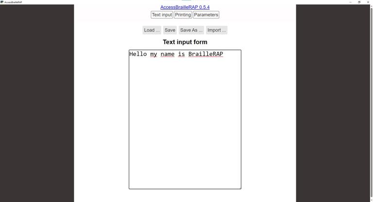
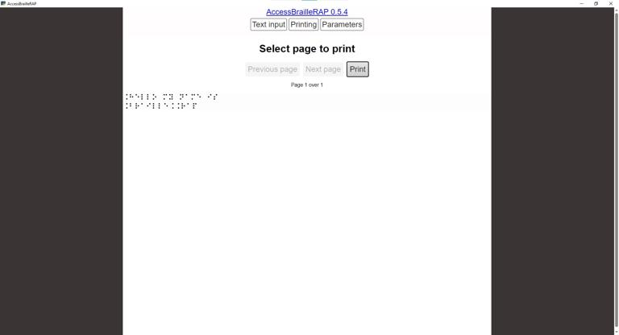
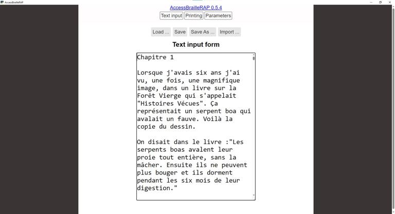
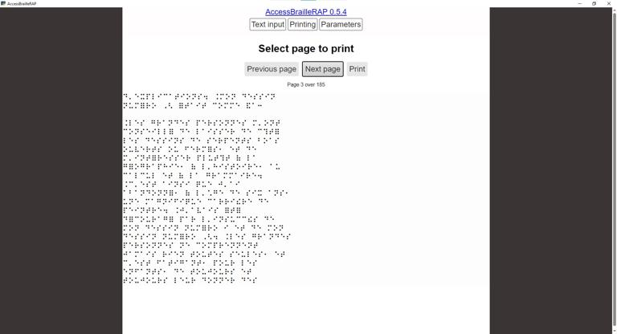
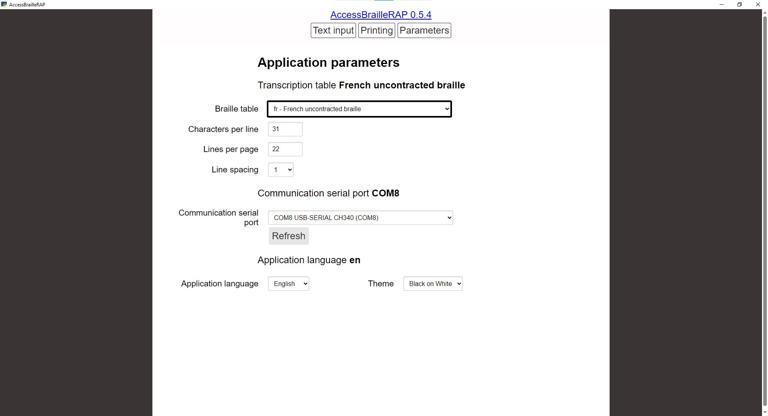

# AccessBrailleRAP
Braille transcription software for BrailleRAP. AccessBrailleRAP allow you to input some text or extract brut text from a open office document, translate the text in Braille and send it to the [BrailleRAP](https://github.com/braillerap/BrailleRap) embosser. AccessBrailleRAP is tested and compatible with NVDA screen reader.

AccessBrailleRAP use several open source licensed software:
- liblouisreact, a liblouis version slightly modified to run in react.js environnement.
- liblouis 
- pandoc
- pywebview

## Releases
We provide pre-built binaries for Windows and Linux. See [releases](https://github.com/BrailleRAP/AccessBrailleRAP/releases) for more information.

AccessBrailleRAP depends on glibc version. Unfortunately Debian12 and Ubuntu24 distribution are not using exactly the same. 
If your are using Debian12 or a derivate distribution, use desktopbraillerap-debian. 
If you are using Ubuntu24.04 or a derivate distribution, use desktopbraillerap-ubuntu

To use the BrailleRAP embosser from Linux, the user need permission to use the serial port. This generaly mean that your user need to be in the dialout group.

## LibLouis
AccessBrailleRAP use liblouis to translate text into Braille. You can select the Braille language (English, French...), contracted or uncontacted Braille, and 6 dots or 8 Dots Braille standards.
The original version of liblouis is available here [https://github.com/liblouis/liblouis](https://github.com/liblouis/liblouis)
The modified version for react.js is available here [https://github.com/crocsg/liblouis](https://github.com/crocsg/liblouis)
The module for react.js is available here [https://github.com/crocsg/liblouisreact](https://github.com/crocsg/liblouisreact)

liblouis and liblouisreact are licensed under GNU LGPL V2.1

## Pandoc
AccesBrailleRAP use pandoc via pypandoc python module, to extract plain text from various file format as word or open office document. So you can open an .odt file, translate it into Braille and emboss.

the original version of pandoc is available here [www.pandoc.org](https://www.pandoc.org)

pandoc is licensed under GNU GPL V2.

## Pywebview

AccessBrailleRAP use pywebview to display the react.js GUI embedded in Python backend.
Pywebview is a cross-platform wrapper around the webview library.
The original version of pywebview is available here [https://github.com/r0x0/pywebview](https://github.com/r0x0/pywebview)

pywebview is licensed under MIT.

## License

AccessBrailleRAP is licensed under GNU GPL V3.

## Features

- Translate text into Braille
- Translate word document into Braille
- Emboss Braille on BrailleRAP embosser

## Screenshots

## User Manual
the user manual is available here : [https://accessbraillerap.readthedocs.io/fr/latest/](https://accessbraillerap.readthedocs.io/en/latest/)

**en** 

**el** 

**fr** 

## Contributing

### Translation
A few month ago, we started with just 2 languages, English and French. Thanks to the codeberg collaborative translate platform, AccessBrailleRAP now have 9 languages available.
If you need the software in your locale language, we will be happy to add a new translation. Translation files are hosted on codeberg community translation platform and can be updated by anyone. See [weblate host on codeberg](https://translate.codeberg.org/projects/accessbraillerap_translate/ihm/) for more information.

### Code and features
Feel free to open issues or pull requests ! We will be happy to review and merge your changes. BTW we have a great focus on accessibility and user friendly design.

## Translations status

### Software GUI
GUI translation files are available [on codeberg weblate host](https://translate.codeberg.org/projects/accessbraillerap_translate/ihm/) . Some languages are partialy translated , we are looking for contributors to complete and check them.     

### User manual
User manual translation files are available [on codeberg weblate host](https://translate.codeberg.org/projects/accessbraillerap_doc/) . Some languages are partialy translated , we are looking for contributors to complete and check them.    

## Funding
This project is funded through [NGI0 Entrust](https://nlnet.nl/entrust), a fund established by [NLnet](https://nlnet.nl) with financial support from the European Commission's [Next Generation Internet](https://ngi.eu) program. Learn more at the [NLnet project page](https://nlnet.nl/project/BrailleRAP).

# Building from source for Windows, Linux based or Raspberry

Thanks to **Jon** whe have a  [comprehensive building manual](DETAILED_INSTALLATION_BRAILLERAP.md) for various systems. 

# Building for Linux using Docker

You can use Docker configuration to build AccessBrailleRAP for a Linux distribution. 

Docker configuration to build AccessBrailleRAP for Debian or Ubuntu are available here:

[Debian 12](https://github.com/braillerap/BuildAccessBrailleRAPDebian)

[Ubuntu 24](https://github.com/braillerap/BuildAccessBrailleRAPLinux)
