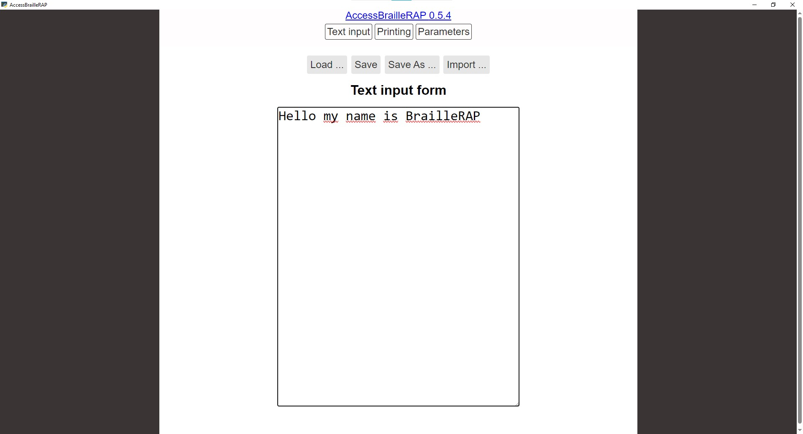

# AccessBrailleRAP
Braille transcription software for BrailleRAP. NVDA compatible.


# Screenshot



# How to install
Install Chrome
Install BrailleRAP [drivers](https://braillerap.readthedocs.io/fr/latest/drivers_mks.html) 
Run the application AccesBrailleRAP.exe


# Instruction for build

Environnement Install
=====================

You'll need to have Chrome installed.
You’ll need to have Python >= 3.6, Eel, pyinstaller, pySerial...

First make a python virtual env.

Install all python depencies with:
```
$ pip install -r requirement.txt 
```

Develop on GUI
==============

```
$ yarn install
$ yarn start
```

Build as GUI App
================

```
$ yarn build
```

check `dist/AccessBrailleRAP.exe`


