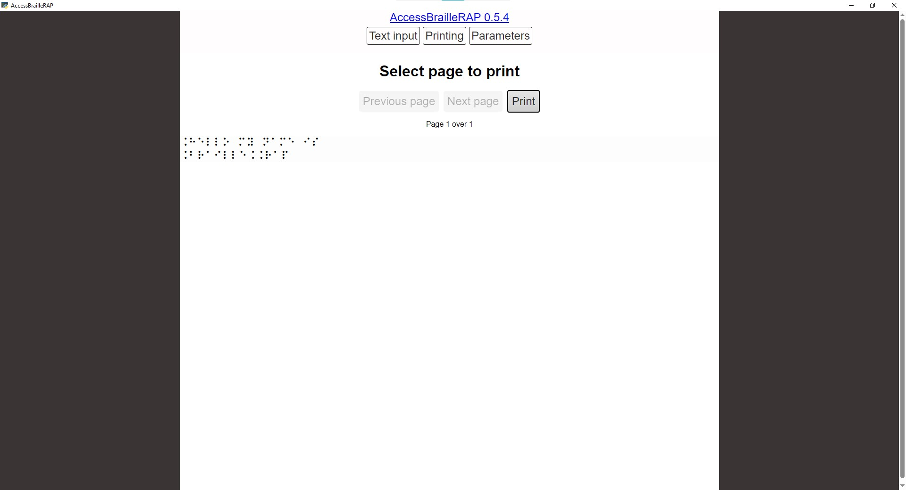
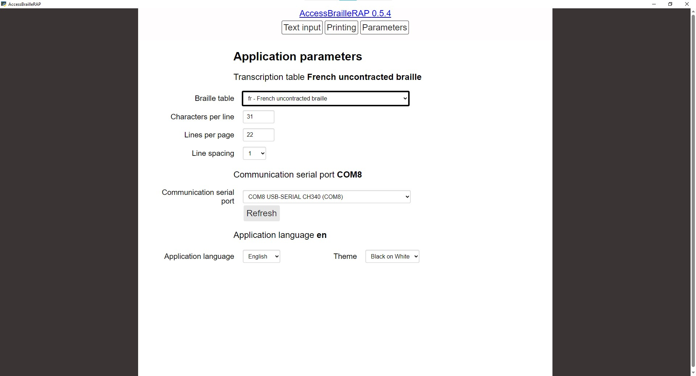

# AccessBrailleRAP
Braille transcription software for BrailleRAP. NVDA compatible.
The project use several open source licensed software:
- liblouisreact, a liblouis version slightly modified to run in react.js environnement.
- liblouis 
- pandoc
- pywebview

## Release
You wil find packaged installation in [release](https://github.com/braillerap/AccessBrailleRAP/releases).

## LibLouis
AccessBrailleRAP use liblouis to translate text into Braille. You can select the Braille language (English, French...), contracted or uncontacted Braille, and 6 dots or 8 Dots Braille standard.
The original version of liblouis is available here [https://github.com/liblouis/liblouis](https://github.com/liblouis/liblouis)
The modified version for react.js is available here [https://github.com/crocsg/liblouis](https://github.com/crocsg/liblouis)
The module for react.js is available here [https://github.com/crocsg/liblouisreact](https://github.com/crocsg/liblouisreact)

liblouis and liblouisreact are licensed under GNU LGPL V2.1

## Pandoc
AccesBrailleRAP use pandoc via pypandoc python module, to extract plain text from various file format as word or open office document. So you can open an .odt file, translate it into Braille and emboss.

the original version of pandoc is available here [www.pandoc.org](https://www.pandoc.org)

pandoc is licensed under GNU GPL V2.

## Pywebview

AccessBrailleRAP use pywebview to display the react.js GUI in embedded in Python backend.
Pywebview is a cross-platform wrapper around the webview library.
The original version of pywebview is available here [https://github.com/r0x0/pywebview](https://github.com/r0x0/pywebview)

pywebview is licensed under MIT.

## License

AccessBrailleRAP is licensed under GNU GPL V3.

## Features

- Translate text into Braille
- Translate word document into Braille
- Emboss Braille on BrailleRAP embosser

## Screenshot







## How to install
Download the latest installer from github [release](https://github.com/braillerap/AccessBrailleRAP/releases)

Select last stable release or lastest development version.

The installer will install AccesBrailleRAP and the needed drivers to control BrailleRAP.


## Contributing

### Translation
If you need the software in your locale language, we will be happy to add a new translation. Translation files are hosted on codeberg community translation platform and can be updated by anyone [weblate host on codeberg](https://translate.codeberg.org/projects/accessbraillerap_translate/ihm/) for more information.

### Code and features
Feel free to open issues or pull requests ! We will be happy to review and merge your changes. BTW we have a great focus on accessibility and user friendly design.

## Translations status

Translation files are available [on codeberg weblate host](https://translate.codeberg.org/projects/accessbraillerap_translate/ihm/) . Some languages are partialy translated , we are looking for contributors to complete and check them.     

| Locale              | Status | 
| :------------------ | :------: |
| Arabic              |   OK   | 
| Dutch               |  Partial - need someone to check it   | 
| English             |   OK   | 
| French              |   OK   | 
| Spanish             |  Partial - need someone to check it   | 
| Ukrainian           |   OK   | 


## Instruction for build (Windows)

Environnement Install
=====================

You’ll need to have Python >= 3.6 and some python dependencies : pyinstaller, pySerial...


First make a python virtual env in a power shell.
```
$ python -m venv venv 
```

Activate the virtual env (power shell)
```
$ .\venv\Scripts\activate.ps1  
```

Install all python depencies with:
```
$ pip install -r requirement.txt 
```

Install all react/js dependencies
```
$ npm i
```

Start the App in debug mode (developpement use)
===============================================

```
$ npm run startview
```

Build the App
=============

```
$ npm run buildview
```

check `dist/AccessBrailleRAP/AccessBrailleRAP.exe`


