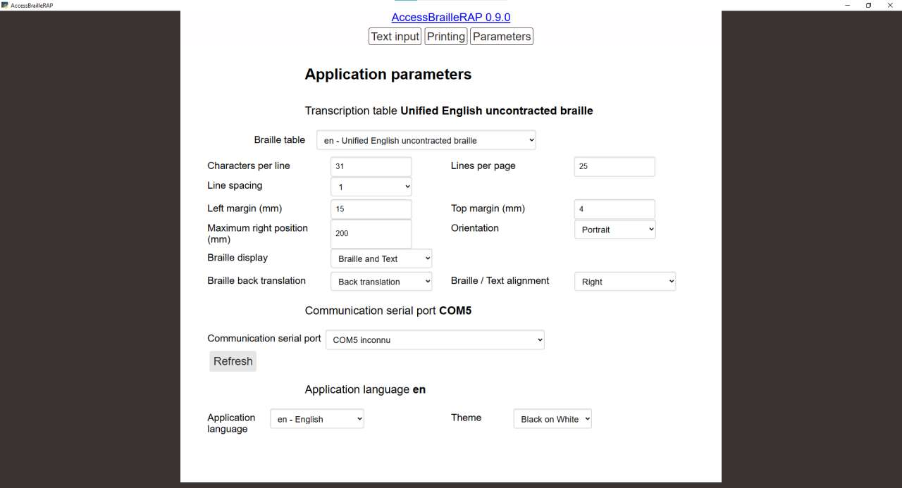
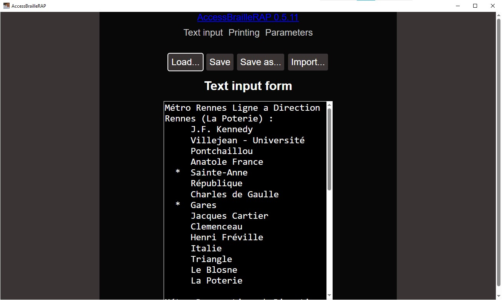
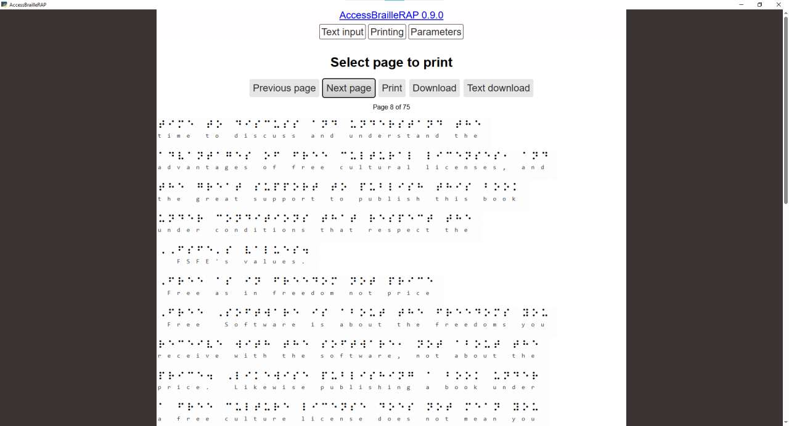

# Tour d'horizon des fonctions d' AccessBrailleRAP


## Les options du menu principal

### Saisie
Affiche une page permettant de manipuler le texte à transcrire en Braille

### Impression
Affiche les options relatives à l'embossage du doument sur une BrailleRAP

### Paramètres
Affiche une page relative au paramétrage de l'application




## Saisie

### Introduction
L'action de cliquer sur l'option *Saisie* affiche une page relative à la manipulation du texte à transcrire en Braille.



### Bouton *Ouvrir*
Affiche une boîte de dialogue qui permet de sélectionner un fichier texte à ouvrir.

### Bouton *Enregistrer* 
Si le document est déjà enregistré, il est simplement sauvegardé. Sinon, une boîte de dialogue s'affiche et permet de sélectionner un nom de fichier texte à enregistrer.

### Bouton *Enregistrer sous...*
Affiche une boîte de dialogue qui permet de sélectionner un nom fichier texte à enregistrer.

### Bouton *Importer*
Affiche une boîte de dialogue qui permet de sélectionner un fichier à importer. L'importation des fichiers est gérée par la bibliothèque [pandoc](https://pandoc.org/). L'importation consiste à extraire le texte du fichier en supprimant toute les mises en formes de caractères (taille de police, effet de caractères, etc...). L'importation fonctionne avec les documents openoffice et libreoffice mais d'autre format sont disponibles.

### Utilisation de caractères spéciaux dans la zone de saisie

Lors de la saisie d'un texte, il peut être utile d'insérer des caractères Braille qui seront directement intégrés à la transcription Braille sans modification. En effet si l'alphabet Braille est défini pour la transcription de texte, il existe des standards particuliers à certains usages comme la musique, la chimie ou les mathématiques. Ces standards ne sont pour l'instant pas pris en charge par AccessBRailleRAP, il peut donc être utile de saisir directement une petite quantité de caractères Braille. Vous pouvez utiliser la saisie **unicode** ou bien la saisie directe de point Braille.

#### Saisie UNICODE:
  La saisie de caractère Braille utilise la saisie de caractères unicode, dont les valeurs sont comprisent entre x02800 et 0x02900. Pour entrer ces caractères dans la zone de saisie, vous pouvez utiliser la touche `CTRL`+<valeur unicode>. Par exemple pour saisir un caractère Braille avec uniquement le point 1 (l'équivalent du 'a') :


  - Appuyez sur la touche `CTRL`
  - Entrez la valeur 0x en appuyant sur 0 puis x
  - Entrez la valeur UNICODE du caractère Braille, c'est a dire 1.
  - Relâcher la touche `CTRL`

  vous devriez voir apparaitre le caractere Braille *⠁* dans la zone de saisie.

  Vous trouverez sur wikipedia une [table des caractères Braille unicode](https://fr.wikipedia.org/wiki/Table_des_caract%C3%A8res_Unicode/U2800). Les codes des caractères Braille sont donnés en hexadécimal, vous pouvez utiliser uniquement la partie supérieure à 0x2800. Par exemple, si on regarde dans la table, le caractère *⠵* correspond à la valeur unicode 0x2835. Pour entrer ce caractère, vous pouvez utiliser :

  `CTRL`+ 0x2835

  ou bien

  `CTRL`+ 0x35

  Vous pouvez également utiliser des valeur décimale. 0x2835 correspond à 10293. vous pouvez donc entrer le caractère *⠵* en utilisant :

  `CTRL`+ 10293

  ou bien

  `CTRL`+ 53

  Notez que pour utiliser un code hexadécimal, vous devez préfixer la valeur par 0x

  #### Saisie directe des points Braille
  La saisie directe des points Braille reprend le principe de la saisie UNICODE, mais au lieu de rentrer la valeur UNICODE correspondante au caractère souhaité, vous allez pouvoir entrer les numéro des points Braille présent sur le caractère. Pour utiliser la saisie directe, vous devez utiliser le préfixe **'0b'**.

  Par exemple si vous voulez saisir un **s**, le caractère Braille est **⠎** soit les points 2-3-4.
  Pour obtenir ce caractère, vous allez appuyer sur la touche `CTRL` puis sans la relacher entrer le préfixe 0b puis les points souhaitez 234 et enfin vous allez relacher la touche `CTRL`.
  
  donc:

  `CTRL`+ 0b + 234 pour obtenir **⠎**
  
  `CTRL`+ 0b + 1234 pour obtenir **⠏**
  
  `CTRL`+ 0b + 12 pour obtenir **⠃**
  
  vous pouvez également saisir du Braille 8 points. !!! Attention il faut que ce soit cohérent avec le reste du document, la hauteur des cellules Braille est définie par le standard Braille sélectionné dans les paramètres.
  
  `CTRL`+ 0b + 12347 pour obtenir **⡏**
  

## Impression

### Introduction
L'action de cliquer sur l'option *Impression* affiche une page relative à l'embossage du document sur une BrailleRAP. Sur cette page vous pouvez naviguer dans les différentes pages avec les boutons *Page Précédente* et *Page Suivante* et imprimer la page active avec le bouton *Imprimer*. En fonction de l'option sélectionnée dans les paramètres, seul le texte en Braille est affiché, ou bien le texte en Braille est associé au texte en noir.



### Bouton *Page Précédente*
Affiche la page précédente du document à embosser.

### Bouton *Page Suivante*
Affiche la page suivante du document à embosser.

### Bouton *Imprimer*
Embosse (imprime) la page active sur la BrailleRAP connectée en USB.


## Paramètres

### Introduction
  L'action de cliquer sur l'option *Paramètres* affiche une page relative à la configuration du logiciel (nombre de lignes, port de communication, table Braille ...).


### Table Braille
  Cette section permet de définir le standard utilisé pour la transcription du texte en Braille. **Attention** il existe parfois plusieurs standard Braille pour la même langue (3 en Français par exemple) et ce paramêtres est indépendant de la langue de l'interface. Vous pouvez par exemple utiliser AccesBrailleRAP en Français et transcrire le Braille au standard Vietnamien si les lecteurs du document utilisent ce standard Braille.

### Nombre de caractères par ligne
  Cette section permet de définir le nombre de caractères Braille par ligne.

### Nombre de lignes par page
  Cette section permet de définir le nombre lignes de caractères Braille disponible sur une page. Attention il s'agit du nombre de lignes quand on utilise l'interligne 1 (simple).

### Interligne
  Cette valeur permet de choisir l'interligne utilisé pour l'embossage du document. Il existe 3 interlignes : 
  - **1** (interligne simple)
  - **1.5** (un interligne et demi)
  - **2** (interligne double).

### Numérotation des pages
  Cette option permet de choisir le style de numérotation des pages.
  - **Aucune**. Les pages ne seront pas numérotées, on conserve une ligne supplémentaire pour le texte.
  - **En haut de page**. Le numéro de page apparaitra en haut à droite de la page.
  - **En bas de page**. Le numéro de page apparaitra en bas à doite de la page.

### Marge gauche (mm)
  Cette valeur détermine la valeur de la marge à la gauche du document.

### Marge début de page (mm)
  Cette valeur détermine la valeur de la marge en haut du document.

### Position maximum droite (mm)
  Cette valeur détermine la position maximale sur la droite de la feuille en impression paysage. Pour une feuille A4 environ 200 mm, pour une feuille A3 environ 280 mm. Veuillez noter que la BrailleRAP ne detecte pas l'orientation de la feuille, elle tiendra uniquement compte des informations transmisent par AccessBrailleRAP. La fonction paysage est donc destinée à embosser un texte en paysage sur une feuille insérée en mode portrait !

### Orientation
  Cette valeur détermine l'orientation de l'impression. 
  - **Portrait** : Les lignes seront imprimées paralellement au bord haut de la feuille.
  - **Paysage** : La lignes seront imprimées paralellement au bord droit de la feuille. La première ligne sera imprimée à la position **Position maximum droite (mm)**

### Affichage Braille
  Cette option permet de sélectionner le type d'affichage Braille dans la page consacrée à l'impression.
  - **Braille et Texte** : Le texte en Braille est affiché, avec le texte en noir juste en dessous.
  - **Braille seulement** : Seul le texte en Braille est affiché.
  Cette option ne change pas l'impression, la BrailleRAP embossera uniquement le Braille. Le double affichage Braille / texte en noir vous permet, si vous êtes voyant, d'améliorer la mise en page du Braille sans réinterpréter le Braille. 

  
```{figure} ./IMG/brailleandtextdisplay.png
:scale: 100 %
:alt: Un extrait d'une ligne affichée avec l'option Braille et Texte
*Un extrait d'une ligne affichée avec l'option Braille et Texte*

```

### Transcription Braille inversée
  Cette option détermine la manière dont sera produit le texte en noir affiché en association avec le texte en Braille. 
  - **Transcription inverse** : Liblouis sera utilisé pour produire le texte en noir en effectuant une transcription du Braille vers le texte.
  - **Texte original** : Dans certaine langue, la transcription inverse de Liblouis fonctionne mal. Cette option permet d'utiliser le texte original avant transcription en Braille. 

### Alignement Braille / texte en noir
  Cette option vous permet de choisr la méthode souhaitée pour aligner le texte en noir par rapport au Braille. En effet la transcription Braille ajoute dans certain cas des caractères pour marquer des situations spécifiques (Majuscule, symbole tout en majuscules ...)
  - **A droite** : Aligne chaque mot du texte en noir sur la fin du texte en Braille. C'est suffisant pour des prefixes simples comme la majuscule en Braille Français '⠨'. Par contre, cela peut devenir difficile à lire dans certain cas, notamment quand les sequences d'échapement sont situées au milieu d'un mot. Par exemple BrailleRAP se transcrit en français par ⠨⠃⠗⠁⠊⠇⠇⠑⠨⠨⠗⠁⠏, l'alignement à droite va aligner correctement le 'RAP' de la fin, par contre le début du mot sera décalé a  cause du double symbole de majuscule '⠨⠨'. 
  - **Meilleure option** : Cette option utilise la transcription Braille du mot en minuscule pour ajuster au mieux le début du mot en Braille et le mot en noir pour faciliter la lecture conjoite du texte et du Braille. Cette option est utilisé avec certain standard Braille qui ajoute des suffixes à la fin des mots.

```{figure} ./IMG/braillealign_right.png
:scale: 100 %
:alt: Un extrait d'une ligne affichée avec l'option Braille et Texte, le Braille et le texte sont alignés à droite
*Alignement à droite, on constate que la fin du mot (RAP) est bien aligné sur le Braille. Par contre l'utilisation de la séquence '⠠⠠' pour représenter les majuscules, entraine un décalage du début du mot.*

```
```{figure} ./IMG/braillealign_bestfit.png
:scale: 100 %
:alt: Un extrait d'une ligne affichée avec l'option Braille et Texte, le Braille et le texte sont alignés au mieux
*Meilleure option, Malgré l'utilisation de la séquence '⠠⠠' pour représenter les majuscules, on constate que le début du mot est bien aligné lettre à lettre.*

```

### Port de communication
  Cette valeur désigne le port de communication utilisé pour la communication avec la BrailleRAP. Si vous avez branché la BrailleRAP après le lancement du logiciel, vous pouvez rafraichir la liste des ports de communication disponible en utilisant le bouton **Actualiser**.

### Langue de l'application
  Cette valeur permet de définir la langue de l'interface de l'application.

### Thème
  Cette valeur permet de définir le thème de l'interface de l'application, vous avez la possibilité de choisir entre une interface claire sur fond sombre ou une interface sombre sur fond clair.

```{figure} ./IMG/theme_bonw.png
:scale: 100 %
:alt: Un apercu du theme sombre sur fond clair
*Un apercu du thème sombre sur fond clair*

```

```{figure} ./IMG/theme_bonw.png
:scale: 100 %
:alt: Un apercu du theme clair sur fond sombre
*Un apercu du thème clair sur fond sombre*

```