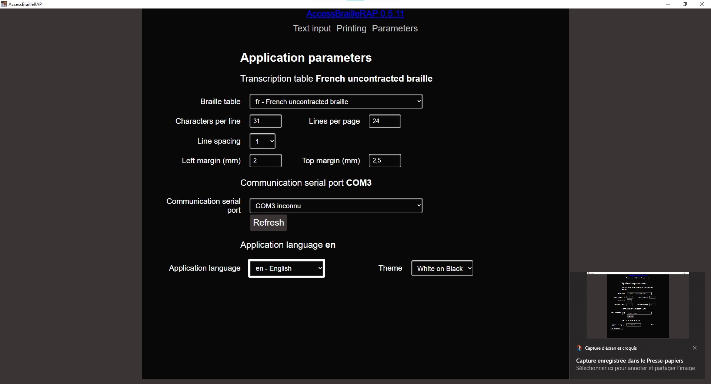

# Tour d'horizon des fonctions d' AccessBrailleRAP

## Les options du menu principal

### Saisie
Affiche une page permettant de manipuler le texte à transcrire en Braille

### Impression
Affiche les options relatives à l'embossage du doument sur une BrailleRAP

### Paramètres
Affiche une page relative au paramétrage de l'application

## Saisie

### Introduction
L'action de cliquer sur l'option *Saisie* affiche une page relative à la manipulation du texte à transcrire en Braille.

### Bouton *Ouvrir*
Affiche une boîte de dialogue qui permet de sélectionner un fichier texte à ouvrir.

### Bouton *Enregistrer* 
Si le document est déjà enregistré, il est simplement sauvegardé. Sinon, une boîte de dialogue s'affiche et permet de sélectionner un nom de fichier texte à enregistrer.

### Bouton *Enregistrer sous...*
Affiche une boîte de dialogue qui permet de sélectionner un nom fichier texte à enregistrer.

### Bouton *Importer*
Affiche une boîte de dialogue qui permet de sélectionner un fichier à importer. L'importation des fichiers est gérée par la bibliothèque [pandoc](https://pandoc.org/). L'importation consiste à extraire le texte du fichier en supprimant toute les mises en formes de caractères (taille de police, effet de caractères, etc...). L'importation fonctionne avec les documents openoffice et libreoffice mais d'autre format sont disponibles.

## Impression

### Introduction
L'action de cliquer sur l'option *Impression* affiche une page relative à l'embossage du document sur une BrailleRAP. Sur cette page vous pouvez naviguer dans les différentes pages avec les boutons *Page Précédente* et *Page Suivante* et imprimer la page active avec le bouton *Imprimer*.

### Bouton *Page Précédente*
Affiche la page précédente du document à embosser.

### Bouton *Page Suivante*
Affiche la page suivante du document à embosser.

### Bouton *Imprimer*
Embosse (imprime) la page active sur la BrailleRAP connectée en USB.

## Paramètres

### Introduction
L'action de cliquer sur l'option *Paramètres* affiche une page relative à la coniguration du logiciel (nombre de lignes, port de communication, table Braille ...).

#### Table Braille
Cette section permet de définir le standard utilisé pour la transcription du texte en Braille. **Attention** il existe parfois plusieurs standard Braille pour la même langue (3 en Français par exemple) et ce paramêtres est indépendant de la langue de l'interface. Vous pouvez par exemple utiliser AccesBrailleRAP en Français et transcrire le Braille au standard Vietnamien si les lecteurs du document utilisent ce standard Braille.

#### Nombre de caractères par ligne
Cette section permet de définir le nombre de caractères Braille par ligne.

#### Nombre de lignes par page
Cette section permet de définir le nombre lignes de caractères Braille disponible sur une page. Attention il s'agit du nombre de lignes quand on utilise l'interligne 1 (simple).

#### Interligne
Cette valeur permet de choisir l'interligne utilisé pour l'embossage du document. Il existe 3 interlignes : 1 (simple), 1.5 (un interligne et demi) et 2 (double).

#### Marge gauche (mm)
Cette valeur détermine la valeur de la marge à la gauche du document.

#### Marge début de page (mm)
Cette valeur détermine la valeur de la marge en haut du document.

#### Port de communication
Cette valeur désigne le port de communication utilisé pour la communication avec la BrailleRAP. Si vous avez branché la BrailleRAP après le lancement du logiciel, vous pouvez rafraichir la liste des ports de communication disponible en utilisant le bouton *Actualiser*.

#### Langue de l'application
Cette valeur permet de définir la langue de l'interface de l'application.

#### Thème
Cette valeur permet de définir le thème de l'interface de l'application, vous avez la possibilité de choisir entre une interface claire sur fond sombre ou une interface sombre sur fond clair.

