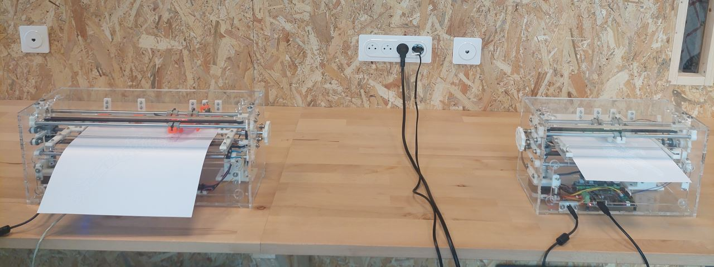
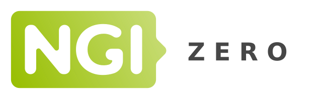

# Introduction

## Présentation

**AccessBrailleRAP** est un outil de traduction en Braille destiné a réaliser des documents embossés sur une embosseuse [**BrailleRAP**](https://www.braillerap.org). Par documents en Braille on entend des documents qui contiennent des textes mis en relief dans le standard Braille sélectionné. Pour rappel [**BrailleRAP**](https://www.braillerap.org) est une embosseuse DIY (Do It Yourself) open source permettant de réaliser des documents en Braille mais également de mettre des graphiques en relief.

Voici un exemple de document réalisé avec AccessBrailleRAP et une BrailleRAP:

 

Une BrailleRAP XL à Gauche, Une BrailleRAP standard à droite.

 

## Financement

Ce projet est financé grace à [NGI0 Entrust](https://nlnet.nl/entrust), un fond créé par [NLnet](https://nlnet.nl) avec le support du programme  [Next Generation Internet](https://ngi.eu) de la Commision Européene. Plus d'informations ici [NLnet project page](https://nlnet.nl/project/BrailleRAP).

 
 

